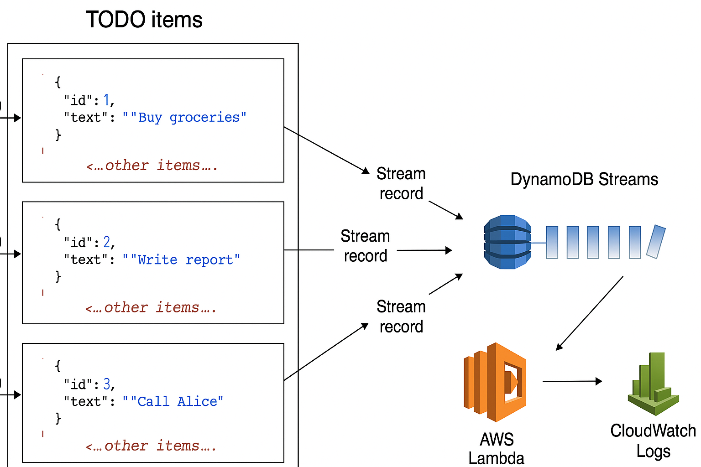

# Serverless Todo Application with AWS DynamoDB

This repository contains a serverless Todo application leveraging [Amazon DynamoDB](https://aws.amazon.com/dynamodb/) as the database, with DynamoDB Streams triggering AWS Lambda functions, and integrated with CloudWatch Logs for monitoring.

## Table of Contents

- [Serverless Todo Application with AWS DynamoDB](#serverless-todo-application-with-aws-dynamodb)
  - [Table of Contents](#table-of-contents)
  - [Overview](#overview)
  - [Architecture](#architecture)
  - [Prerequisites](#prerequisites)
  - [Setup](#setup)
  - [Usage](#usage)
  - [Examples](#examples)
    - [Todo Application Interface](#todo-application-interface)
    - [DynamoDB Database Items](#dynamodb-database-items)
    - [Lambda Function Trigger](#lambda-function-trigger)
    - [Lambda Function Code](#lambda-function-code)
    - [Adding New Items](#adding-new-items)
    - [CloudWatch Logs Monitoring](#cloudwatch-logs-monitoring)
  - [Screenshots](#screenshots)
  - [Resources](#resources)

## Overview

This project demonstrates a serverless architecture for a Todo application using AWS services:
- **DynamoDB** for storing todo items.
- **DynamoDB Streams** to trigger **AWS Lambda** functions on data changes.
- **CloudWatch Logs** for monitoring Lambda executions and application activity.

## Architecture



**Flow:**
1. Client sends requests to API Gateway
2. API Gateway routes requests to Lambda CRUD function
3. Lambda function performs operations on DynamoDB table
4. DynamoDB Streams captures data changes
5. Stream events trigger monitoring Lambda function
6. Lambda logs activities to CloudWatch for monitoring

## Prerequisites

- AWS account
- AWS CLI configured
- Node.js


## Setup

1. Clone this repository:
        ```bash
        git clone https://github.com/MdShimulMahmud/aws-dynamodb-examples.git
        cd aws-dynamodb-examples
        # Install dependencies
        npm install
        npm start
       ```
2. Configure your AWS credentials:
        ```bash
        aws configure
        ```
Your application will be running on `http://localhost:3000` or the specified port.

## Usage

- Add, update, and delete todo items via the API.
- DynamoDB Streams will trigger Lambda functions on item changes.
- Monitor logs and invocations in CloudWatch.

## Examples

### Todo Application Interface
The application provides a simple interface for managing todo items:


### DynamoDB Database Items
Todo items are stored in DynamoDB with their respective attributes:


### Lambda Function Trigger
DynamoDB Streams trigger Lambda functions when items are modified:


### Lambda Function Code
The Lambda function processes DynamoDB Stream events:


### Adding New Items
When new todo items are added through the interface:


The items are stored in the DynamoDB table:


### CloudWatch Logs Monitoring
Lambda executions and application activities are logged in CloudWatch:


When items are removed, the logs capture the deletion events:


After adding multiple items, you can see the complete activity log:


## Screenshots

This section demonstrates the complete workflow of the serverless todo application, from the user interface to the underlying AWS services including DynamoDB storage, Lambda function triggers, and CloudWatch monitoring.

## Resources

- [AWS DynamoDB Documentation](https://docs.aws.amazon.com/dynamodb/)
- [AWS Lambda Documentation](https://docs.aws.amazon.com/lambda/)
- [DynamoDB Streams](https://docs.aws.amazon.com/amazondynamodb/latest/developerguide/Streams.html)
- [CloudWatch Logs](https://docs.aws.amazon.com/AmazonCloudWatch/latest/logs/WhatIsCloudWatchLogs.html)
- [Serverless Framework](https://www.serverless.com/)

---

Happy learning!!